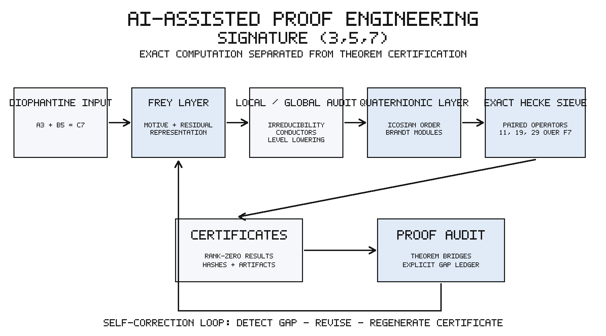

# Beal Conjecture Research Project

This repository is part of a larger attempt to study the generalized Beal equation

\[
A^x + B^y = C^z,
\]

for exponents greater than two and primitive integer solutions. The long-term goal is not just to test isolated examples, but to build a reusable research workflow for the broader theorem.

At the moment, the completed implementation is focused on one difficult signature:

\[
A^3 + B^5 = C^7.
\]

The `(3,5,7)` case is the first full test of the approach. It gives us a concrete place to develop the arithmetic, write the computational tools, audit the proof dependencies, and see which parts can later be generalized to other exponent triples.



## What the project does

The repository combines arithmetic geometry, exact computation and proof auditing. The aim is not to ask an AI system for a polished proof and accept the output. Instead, the system has to turn each mathematical step into something that can be checked, reproduced and inspected.

For the `(3,5,7)` case, the workflow includes:

- the initial reduction to primitive solutions;
- construction of the relevant Frey curve;
- local analysis at the primes dividing the exponents and the level;
- conductor and finite-flat calculations;
- ray class group computations and enumeration of 360 characters;
- residual irreducibility checks;
- exact Brandt-module and Hecke-operator computations;
- saved certificates and audit notes for the important computational steps.

The project also keeps failed approaches and corrections. Several arguments looked plausible during development but turned out to contain a gap or a circular dependency. Those cases are documented instead of being silently removed, because they matter for understanding the real state of the proof.

## Current result for `(3,5,7)`

The main computational search is complete at the four expected levels:

- level `(2,2)`: no compatible eigensystem;
- level `(2,3)`: filter chain `226 -> 8 -> 4 -> 0`;
- level `(3,2)`: filter chain `406 -> 15 -> 4 -> 0`;
- level `(3,3)`: zero survivors after the filters at `11`, `19` and `29`.

The reducible branch was reduced from the full ray-character list to one explicit survivor, `(90,0)`. Three of the four irreducibility lemmas are closed in the current audit.

So the large finite computations are no longer the main obstacle. The remaining gap is a small but genuine theoretical step.

## What is still open

The full `(3,5,7)` theorem is not claimed yet.

The last survivor must be eliminated without using a level-lowering result that already assumes irreducibility. The preferred route is a weight-two Hilbert Eisenstein argument. Most of the expected arithmetic is known, including the constant-term factor

```text
zeta_F(-1)(1-N(3))(1-N(sqrt(5))) = 16/15,
```

which is a `7`-adic unit. What remains is to make the stabilization, all-cusp constant terms, integrality and congruence transfer completely precise.

A second possible route would use an explicit real-multiplication correspondence, but the required action is not available in the source currently being used.

After Lemma D is closed, the final Jacquet–Langlands/Brandt bridge still needs a clean theorem-level write-up connecting the level-lowered residual system to the exact computed modules.

## Long-term direction

The broader goal is to move beyond `(3,5,7)` and study the generalized Beal problem across more signatures.

The current case is useful because it forces the project to solve several problems that will appear again:

- how to organize local arithmetic checks;
- how to enumerate and reduce character cases;
- how to connect modularity arguments with exact computation;
- how to detect circular reasoning in a long proof pipeline;
- how to save enough evidence for another researcher to reproduce the result.

Not every part of the `(3,5,7)` argument will generalize unchanged. The point of this repository is to separate reusable machinery from signature-specific mathematics, then improve the framework one case at a time.

## What can be claimed safely

This repository contains an exact and reproducible research pipeline for the generalized Fermat signature `(3,5,7)`. It completes the main computational elimination, closes three irreducibility lemmas, reduces the fourth to one explicit survivor, and identifies a bounded theoretical path for finishing the case.

It does **not** claim a proof of the full Beal conjecture. It also does **not** yet claim a complete proof of the `(3,5,7)` case.

## Where to start

- `DEMO.md` — short project presentation;
- `PROJECT_STATUS.md` — current status and safe claims;
- `NEXT_STEPS.md` — remaining work in priority order;
- `CURRENT_PROOF_SNAPSHOT.md` — frozen mathematical snapshot;
- `LOGICAL_PROOF_AUDIT.md` — dependency and circularity audit;
- `MANUSCRIPT_357_FROM_SCRATCH.md` — longer proof draft.

## Repository structure

- `scripts/` contains the computational programs;
- `data/` contains saved outputs, caches and intermediate results;
- certificate and audit files explain what individual calculations establish;
- `full/` contains early work toward the wider generalized problem and is not part of the completed `(3,5,7)` pipeline.

The code and finite computations are mostly finished. The remaining work is concentrated in the final theoretical bridge and its proof-quality write-up.